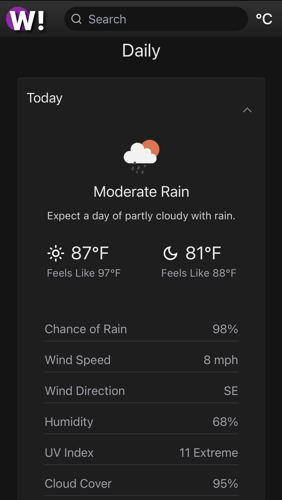

# Weather

Get the current weather and daily forecast. [Live demo](https://weatheremeibech.netlify.app/).

## Table of Contents
* [Summary](#general-information)
* [Technologies used](#technologies-and-techniques-used)
* [Features](#features)
* [Screenshots](#screenshots)
* [Usage](#usage)

## Summary
A web application for getting current weather and daily forecast information based on a city parameter. On initial load, the app will fetch the weather information based on the approximate location of your IP address. You can then use the search function to get the weather information for a specific city. The design is minimal, clean, and responsive, and the data fetched is minimized to only include the most pertinent ones in order to avoid information overload.

## Technologies Used
  

## Features
- Get current weather information
- Get daily weather forecast for up to seven days
- Toggle between metric and imperial units
- Search weather by city
- Dropdown suggestions when searching
- Skeleton loaders while fetching data

## Screenshots
   

## Usage
**You need Git and NPM installed.**

Clone the repo
```bash
git clone https://github.com/emeibech/weather-fe.git
```
Install dependencies
```bash
npm install
```