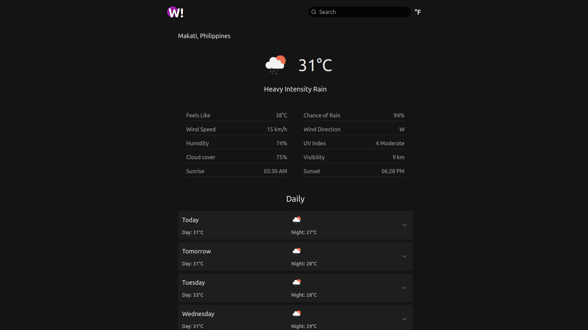
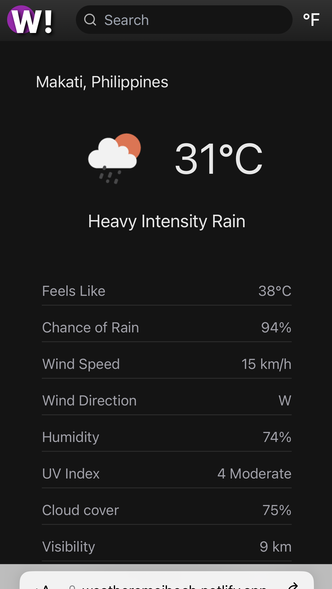
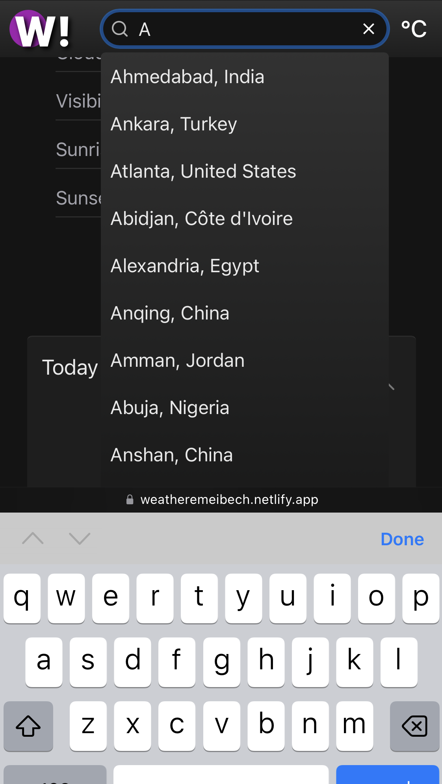

# Weather

Get the current weather and daily forecast. [Live demo](https://weatheremeibech.netlify.app/).

## Table of Contents
* [Summary](#general-information)
* [Technologies used](#technologies-and-techniques-used)
* [Features](#features)
* [Screenshots](#screenshots)
* [Usage](#usage)

## Summary
Weather! is a web application for looking up the current weather and daily forecast information of a city. On initial load, the app will fetch the weather information of the approximate location provided by the client's IP address, after which the client can utilize the search function to get the weather information for a particular city. Employing a clean, minimal, and responsive design, the app displays only the most pertinent information.

## Technologies Used
  

## Features
- Get current weather information
- Get daily weather forecast for up to seven days
- Toggle between metric and imperial units
- Search weather by city
- Dropdown suggestions when searching
- Skeleton loaders while fetching data

## Screenshots
   

## Usage
**You need Git and NPM installed.**

Clone the repo
```bash
git clone https://github.com/emeibech/weather-fe.git
```
Install dependencies
```bash
npm install
```